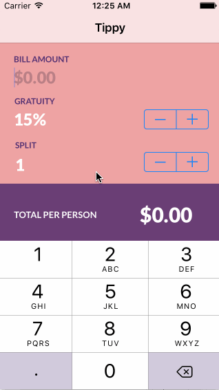

# Pre-work - Tippy

Tippy is a tip calculator application for iOS.

Submitted by: Vandana Pai

Time spent: 5 hours

## User Stories

The following **required** functionality is complete:
* [x] User can enter a bill amount, choose a tip percentage, and see the tip and total values.

The following **optional** features are implemented:
* [x] Custom font
* [ ] UI animations
* [x] Making sure the keyboard is always visible and the bill amount is always the first responder. This way the user doesn't have to tap anywhere to use this app. Just launch the app and start typing.

The following **additional** features are implemented:

* [x] User can calculate how much splitting the bill will cost.
* [x] User can select any tip percentage.

## Video Walkthrough 

Here's a walkthrough of implemented user stories:

GIF created with [LiceCap](http://www.cockos.com/licecap/).

## Notes

* Currently still working on the app. I want to add a custom theme so I can change the appearance of the stepper buttons. Also working on adding UI animations, and possibly adding a default tip percentage option. 
* Understanding the Swift syntax (very different from other languages I've used) and simply navigating Xcode and understanding all of the components has been challenging.
* There are many minute details to creating an app that I had not though of before, and I think it will be an interesting challenge to uncover all of these and try to solve these problems. I'm very used to web development so this is a very different way of creating something.

## License

    Copyright 2017 Vandana Pai

    Licensed under the Apache License, Version 2.0 (the "License");
    you may not use this file except in compliance with the License.
    You may obtain a copy of the License at

        http://www.apache.org/licenses/LICENSE-2.0

    Unless required by applicable law or agreed to in writing, software
    distributed under the License is distributed on an "AS IS" BASIS,
    WITHOUT WARRANTIES OR CONDITIONS OF ANY KIND, either express or implied.
    See the License for the specific language governing permissions and
    limitations under the License.